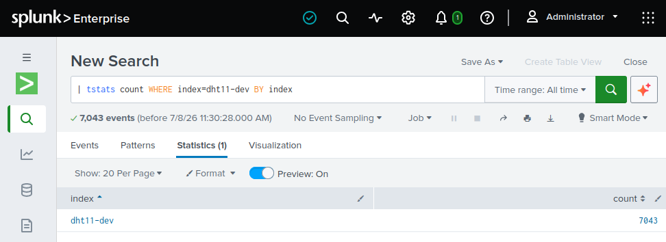
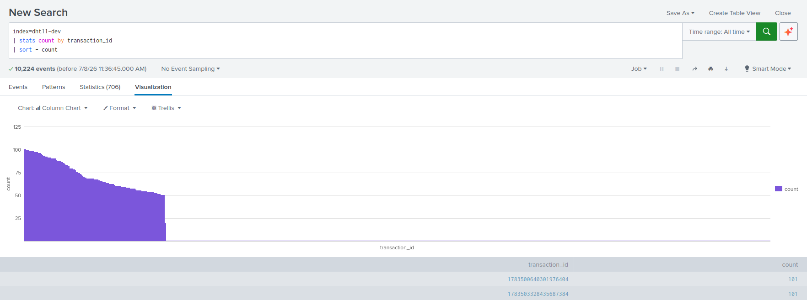

# What to do after indexing

<!-- Cost/volume analysis with Splunk Queries -->

---
---

# Query #1: General view of how your application logs

<br/>

- Get the event count

```spl
| tstats count
    WHERE index=your_index_1 OR index=your_index_2
    BY index
```

<br/>

- More fields for a more granular view

```spl
    BY index, remote_host, status, source
| sort - count
```

<br/>

- Focus the event analysis on the highest-volume sources.



<!-- 
before touching anything

| tstats count WHERE index=dht11-dev BY index
-->

---
---

# Query #2: Look for high events count on transaction

<br/>

- Get a list of transactions grouped by event count

```spl
| tstats count WHERE index=your_index BY transaction_id
| sort - count
```

<div class="text-gray-400 text-sm leading-relaxed">
    If your app logs any <code class="text-blue-300">trx_id</code> kind of field (and it should),
    you can immediately answer: <strong class="text-white">which transaction types
    are generating the most lines?</strong>
  </div>

- Transactions that log way more (or less) events than average are a sign of abnormal behavior



---
---

#  Query #3: Pattern detection

## Look for exact matches

```spl
index=your_index
| stats count by _raw
| sort -count
```

- By using `props.conf` and `transforms.conf` you can replace `_raw` with a more precise subset
- Exact match queries are fast and precise but do not look for patterns

## Look for repeated patterns

```spl
index=your_index
| cluster t=0.9 showcount=true
| table cluster_count _raw
| sort - cluster_count
```

- Split results further for deeper analysis. Use them to isolate frequent events and patterns.
- `| cluster` groups similar log lines __automatically__, no regex needed.

---
layout: center
class: text-center
---

# DEMO!

<!-- 
cluster query and saving to dashboard and alerts.
Also show drilldown

Queries do not watch themselves

You will not go and connect to splunk from time to time to check these results.
Let Splunk do it for you.

And call the splunk application containing them "log_analyzer"

- Create alerts to be notified for:
  - transactions detected with more than `x` events.
  - patterns repeating more than `y` times.
- Create dashboards that monitor the results of these queries.

- Alerts and dashboards provide:
  - A persistent place to visualize the result of your queries
  - A regular watch on the state of your logs

Bonus: Splunk lets you trigger actions on this list
-->

---
layout: default
hide: true
---

# Put It All in a Dashboard

<div class="grid grid-cols-3 gap-4 mt-6">

  <!-- Panel 1 -->
  <div class="bg-white/5 border border-white/10 rounded-xl p-4 flex flex-col gap-2">
    <div class="text-xs uppercase tracking-widest text-gray-500">Panel 1</div>
    <div class="text-white font-semibold text-sm">Index Volume Over Time</div>
    <div class="text-gray-500 text-xs leading-relaxed">
      Timechart of ingestion volume per index.
      Spot regressions — a deployment that suddenly
      doubles log output shows up immediately.
    </div>
    <div class="mt-auto font-mono text-xs text-blue-300/70 pt-2 border-t border-white/10">
      | timechart span=1d sum(kb) by index
    </div>
  </div>

  <!-- Panel 2 -->
  <div class="bg-white/5 border border-white/10 rounded-xl p-4 flex flex-col gap-2">
    <div class="text-xs uppercase tracking-widest text-gray-500">Panel 2</div>
    <div class="text-white font-semibold text-sm">Top Transaction Types</div>
    <div class="text-gray-500 text-xs leading-relaxed">
      Bar chart of log count by transaction type.
      Lets the team see at a glance which flows
      dominate — updated daily.
    </div>
    <div class="mt-auto font-mono text-xs text-blue-300/70 pt-2 border-t border-white/10">
      | stats count by trx_type | sort -count
    </div>
  </div>

  <!-- Panel 3 -->
  <div class="bg-white/5 border border-white/10 rounded-xl p-4 flex flex-col gap-2">
    <div class="text-xs uppercase tracking-widest text-gray-500">Panel 3</div>
    <div class="text-white font-semibold text-sm">Log Level Breakdown</div>
    <div class="text-gray-500 text-xs leading-relaxed">
      Pie or stacked bar of ERROR / WARN / INFO / DEBUG ratio.
      A healthy app should have very little DEBUG in production.
    </div>
    <div class="mt-auto font-mono text-xs text-blue-300/70 pt-2 border-t border-white/10">
      | stats count by log_level
    </div>
  </div>

  <!-- Panel 4 -->
  <div class="bg-white/5 border border-white/10 rounded-xl p-4 flex flex-col gap-2">
    <div class="text-xs uppercase tracking-widest text-gray-500">Panel 4</div>
    <div class="text-white font-semibold text-sm">Top Repeated Patterns</div>
    <div class="text-gray-500 text-xs leading-relaxed">
      Table of the 20 most frequent log templates.
      Each row is a candidate for suppression,
      sampling, or a log level change.
    </div>
    <div class="mt-auto font-mono text-xs text-blue-300/70 pt-2 border-t border-white/10">
      | cluster field=_raw | sort -count
    </div>
  </div>

  <!-- Panel 5 -->
  <div class="bg-white/5 border border-white/10 rounded-xl p-4 flex flex-col gap-2">
    <div class="text-xs uppercase tracking-widest text-gray-500">Panel 5</div>
    <div class="text-white font-semibold text-sm">Outlier Transactions</div>
    <div class="text-gray-500 text-xs leading-relaxed">
      Transactions with line counts more than 2σ
      above average. These are your debugging sessions
      that forgot to turn off verbose logging.
    </div>
    <div class="mt-auto font-mono text-xs text-blue-300/70 pt-2 border-t border-white/10">
      | eventstats avg(count) as avg, stdev(count) as sd by trx_type
    </div>
  </div>

  <!-- Panel 6 -->
  <div v-click class="bg-blue-950/40 border border-blue-500/30 rounded-xl p-4 flex flex-col gap-2">
    <div class="text-xs uppercase tracking-widest text-blue-400">The goal</div>
    <div class="text-white font-semibold text-sm">A shared, living artifact</div>
    <div class="text-gray-400 text-xs leading-relaxed">
      Save this dashboard and share it with your team.
      Schedule the heavy queries as saved searches
      running nightly — the dashboard becomes a
      <strong class="text-white">cost accountability tool</strong>,
      not a one-off investigation.
    </div>
  </div>

</div>

