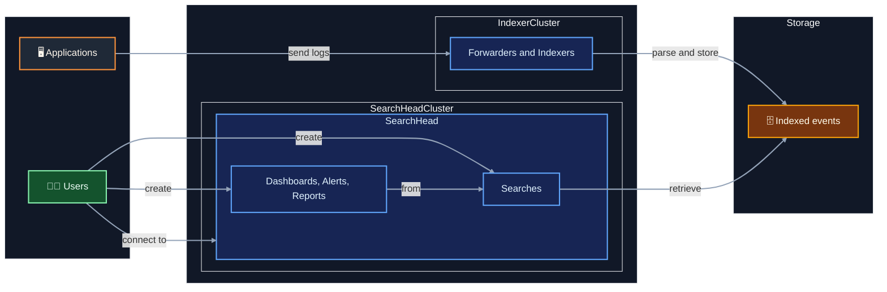

# The DevOps View
## Where cost is born

  

    Your leverage is <strong class="text-white">before</strong> data hits
    the indexer — filter, sample, or drop at the forwarder.
  

  

    
inputs.conf

    
Controls what the forwarder collects — file paths, ports, scripts

  

  

    
props.conf + transforms.conf

    
Filter, route, or drop events before indexing — the most cost-effective lever

  

  

    
indexes.conf

    
Define retention and routing per index — align with data criticality

  

  

    💡 Dropping at the forwarder costs nothing. Dropping after indexing saves nothing.
  

::right::

  

    
# props.conf

    
[source::/var/log/myapp.log]

    
TRANSFORMS-drop = drop-debug-lines

     
    
# transforms.conf

    
[drop-debug-lines]

    
REGEX = \sDEBUG\s

    
DEST_KEY = queue

    
VALUE = nullQueue

  

  

    nullQueue = discarded before indexing
  

  

    
Typical index layout

    

      
📁 app_audit

      
compliance, long retention

      
📁 app_functional

      
business events

      
📁 app_monitoring

      
metrics, health checks

      
📁 app_debug

      
💸 biggest, least read

    

  

---
---

# Overview of Splunk

- __Indexing flow__ enables application events to become searchable insight
- __Search flow__ enables fast searches across huge volumes of events

 

  💡 Savings are made at indexing time. At search time you are left with cost analysis.

---
layout: default
hide: true
---

# Splunk at a Glance

  <!-- Left: DevOps / Ingestion view -->
  

    

      🔧 DevOps View — How logs get in
    

    <!-- Pipeline diagram -->
    

      

        🖥️
        

          
Applications / Services

          
emit logs to stdout, files, or syslog

        

      

      
↓

      

        🚚
        

          
Forwarder

          
Universal Forwarder · HEC · Syslog

        

      

      
↓

      

        ⚙️
        

          
Indexer

          
parses, indexes, stores — this is what you pay for

        

      

      
↓

      

        🗄️
        

          
Indexes

          
partitioned by app / phase / event type

        

      

    

  

  <!-- Right: User / Analyst view -->
  

    

      👤 User View — How you interact with it
    

    

      

        🗂️
        

          
Indexes

          

            Your entry point. One app may write to several indexes:
            audit, functional, monitoring, debug…
          

        

      

      

        🔎
        

          
Search (SPL)

          

            Splunk's query language. The tool we'll use today
            to surface patterns and outliers.
          

        

      

      

        📋
        

          
Saved Searches & Alerts

          

            Schedule queries to run automatically.
            Useful for ongoing volume monitoring.
          

        

      

      

        📊
        

          
Dashboards

          

            We'll build one of these by the end — a live view
            of your log volume, patterns, and top offenders.
          

        

      

    

  

