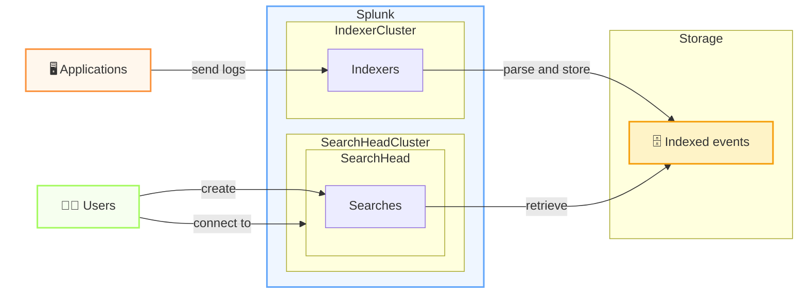

---
---

# Overview of Splunk

  

    
📱💻

    <h3 class="font-semibold mb-2">Applications and users</h3>
    <ul class="text-sm leading-7">
      <li>Applications generate log events continuously</li>
      <li>Users and operators need answers quickly</li>
      <li>Logs are the raw signal for troubleshooting and monitoring</li>
    </ul>
  

  

    
🧠🔎

    <h3 class="font-semibold mb-2">The Splunk platform</h3>
    <ul class="text-sm leading-7">
      <li>Collects, parses, stores, and indexes the data</li>
      <li>Enables fast searches across huge volumes of events</li>
      <li>Turns raw logs into dashboards, alerts, and reports</li>
    </ul>
  

---
---

# How events flow in Splunk

From application logs to searchable insight in a few steps

<!--
  A["🖥️ Applications"] -/->|send logs| B[Forwarders] 
  B -/->|collect| C[Indexers]
-->

