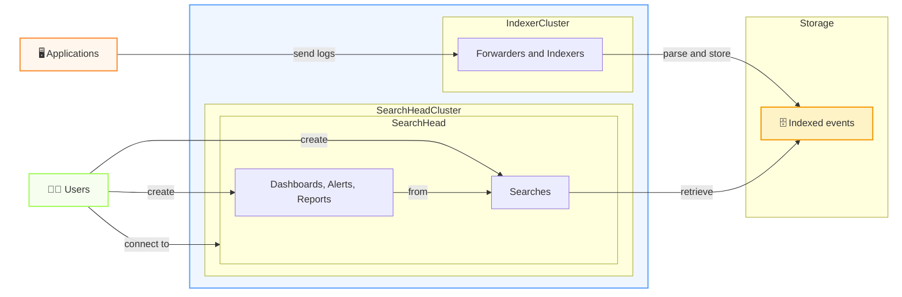

---
---

# Overview of Splunk

The event flow view

- Indexing flow enables application events to become searchable insight
- Search flow enables fast searches across huge volumes of events and can turns the results into dashboards, alerts, and reports

---
---

# Searchhead view of Splunk \[TBC\]

The user entrypoint

- Put screenshots of
  - Search UI
  - Dashboard UI
  - Alert UI
- We are going to use this view for our demos