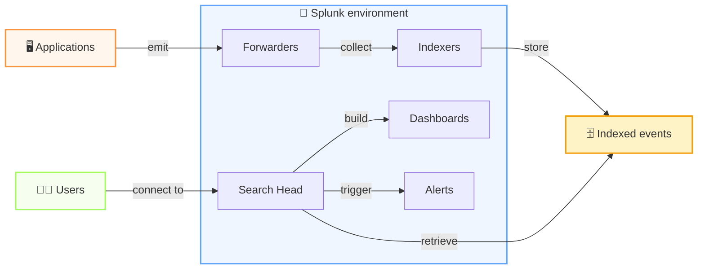

---
# try also 'default' to start simple
theme: seriph
# random image from a curated Unsplash collection by Anthony
# like them? see https://unsplash.com/collections/94734566/slidev
background: https://cover.sli.dev
# some information about your slides (markdown enabled)
title: Reduce Log Ingestion Costs With Pattern Detection in Splunk
info: |
  ## Slidev Starter Template
  Presentation slides for developers.

  Learn more at [Sli.dev](https://sli.dev)
# apply UnoCSS classes to the current slide
class: text-center
# https://sli.dev/features/drawing
drawings:
  persist: false
# slide transition: https://sli.dev/guide/animations.html#slide-transitions
transition: slide-left
# enable Comark Syntax: https://comark.dev/syntax/markdown
comark: true
# duration of the presentation
duration: 35min
---

# Reduce Log Ingestion Costs

with Pattern Detection in Splunk

  Press Space for next page <carbon:arrow-right />

  <button @click="$slidev.nav.openInEditor()" title="Open in Editor" class="slidev-icon-btn">
    <carbon:edit />
  </button>
  <a href="https://github.com/slidevjs/slidev" target="_blank" class="slidev-icon-btn">
    <carbon:logo-github />
  </a>

<!--
The last comment block of each slide will be treated as slide notes. It will be visible and editable in Presenter Mode along with the slide. [Read more in the docs](https://sli.dev/guide/syntax.html#notes)
-->

---
transition: fade-out
---

# Title, abstract and talk info

**Reduce Log Ingestion Costs With Pattern Detection in Splunk**

By Michele Caci

Snorkeling Session (25 min) on Wednesday 8 July 16:40 - 17:05

Amphi 139 (160 places)

This session presents a Splunk dashboard designed to analyze log behavior, reveal high‑volume patterns, and highlight opportunities to reduce ingestion costs. Participants will learn how to identify repetitive noise, detect inefficient logging, and focus on events that matter. The session provides practical techniques to optimize log volume, improve observability, and support data‑driven decisions.

---
transition: fade-out
---

# Outline

Time breakdown idea: **Intro .1-.4**: 5 minutes; **Splunk .5**: 5 minutes; **How .6**: 10 minutes; **Q/A**: 5 minutes

1. Self-intro
2. Introduction: we (amadeus) log a lot, really a lot (vague order of magnitude) and you do too.
3. Problem statement: Many logs = high costs = low signal/noise ratio, 80% of logs are not read (link quote)
4. Main point: if you are using splunk I will show techniques you can use to find ways to reduce logs
5. Splunk overview: high-level architecture + devops view (deployment and log ingestion) vs user view (index creation, searches, splunk application/dashboards and saved searches)
6. What to analyze and how:
- which index to look at (an app can usually log to different indexes according to phase/app component/event type(audit,classic,functional monitoring,...))
- Logging by transaction: if not you should. group and count logs by trx_id. find outliers (transaction with high count)
- Patterns: queries for exact matches and for finding patterns `collect` command and others.
- Put all in a dashboard

---
layout: statement
---

# We have a logging problem

We log a lot

---
layout: statement
---

# I mean we really log a lot

We're talking PBs here

---
layout: statement
---

# And if you're here you probably log a lot too

---
layout: intro
---

# 👋 Hello

Who am I?

- I'm Michele
- I deploy and operate the Amadeus logging infrastructure to help applications detect issues from logs
- My hobbies include languages, board games and silly GIFs with Go

 

<arrow v-after x1="800" y1="305" x2="825" y2="250" color="#F00" width="1" arrowSize="1" />

me

young

actual me

<arrow v-after x1="580" y1="125" x2="640" y2="125" color="#F00" width="1" arrowSize="1" />

こんにちわ！

Bom dia!  

---
layout: fact
---

# 80% of your logs are never read

---
layout: statement
---

# High volume of logs == low signal to noise ratio

---
layout: statement
---

# High volume of logs == high costs

---
transition: fade-out
---

# Splunk provides tools to show you places where you can cut logs

---
transition: fade-out
---

# Overview of Splunk

  

    
📱💻

    <h3 class="font-semibold mb-2">Applications and users</h3>
    <ul class="text-sm leading-7">
      <li>Applications generate log events continuously</li>
      <li>Users and operators need answers quickly</li>
      <li>Logs are the raw signal for troubleshooting and monitoring</li>
    </ul>
  

  

    
🧠🔎

    <h3 class="font-semibold mb-2">The Splunk platform</h3>
    <ul class="text-sm leading-7">
      <li>Collects, parses, stores, and indexes the data</li>
      <li>Enables fast searches across huge volumes of events</li>
      <li>Turns raw logs into dashboards, alerts, and reports</li>
    </ul>
  

---
transition: fade-out
---

# How events flow in Splunk

From application logs to searchable insight in a few steps

  
📤 Applications emit logs

  
📦 Splunk ingests and indexes them

  
🧑‍💻 Users run searches, dashboards, and alerts

---
transition: fade-out
---

# 1. Start with the right scope

  <ul class="text-xl leading-10">
    <li>🧭 Choose the right index and time range first</li>
    <li>🧩 Split data by app, component, phase, or event type</li>
    <li>🎯 Focus on the highest-volume sources before touching everything</li>
  </ul>
  

    
SPL template

    <pre class="text-xs leading-6"><code>index=your_index earliest=-1h latest=now
| stats count by host, source</code></pre>
  

---
transition: fade-out
---

# 2. Group by transaction

  <ul class="text-xl leading-10">
    <li>🔗 Use transaction IDs or correlation IDs when available</li>
    <li>📊 Count events per transaction to reveal noisy flows</li>
    <li>⚠️ Spot outliers: a small number of transactions may explain most of the volume</li>
  </ul>
  

    
SPL template

    <pre class="text-xs leading-6"><code>index=your_index
| stats count by transaction_id
| sort -count</code></pre>
  

---
transition: fade-out
---

# 3. Look for repeated patterns

  <ul class="text-xl leading-10">
    <li>🔎 Search for exact repeated messages and frequent values</li>
    <li>🔁 Watch for retries, boilerplate logs, and duplicate events</li>
    <li>🧠 Use <code>stats</code>, <code>top</code>, <code>rare</code>, and <code>collect</code> to uncover patterns</li>
  </ul>
  

    
SPL template

    <pre class="text-xs leading-6"><code>index=your_index
| stats count by message
| sort -count
| where count > 100</code></pre>
  

---
transition: fade-out
---

# 4. Turn findings into action

  <ul class="text-xl leading-10">
    <li>📈 Build a dashboard, saved search, or alert to keep the signal visible</li>
    <li>🛑 Decide whether to suppress, sample, or redesign noisy logging</li>
    <li>✅ Measure the impact and iterate as the system evolves</li>
  </ul>
  

    
SPL template

    <pre class="text-xs leading-6"><code>index=your_index
| stats count by message
| where count > 1000
| eval action="review logging"</code></pre>
  

---
layout: center
class: text-center
---

# Learn More

[Documentation](https://sli.dev) · [GitHub](https://github.com/slidevjs/slidev) · [Showcases](https://sli.dev/resources/showcases)

<PoweredBySlidev mt-10 />
