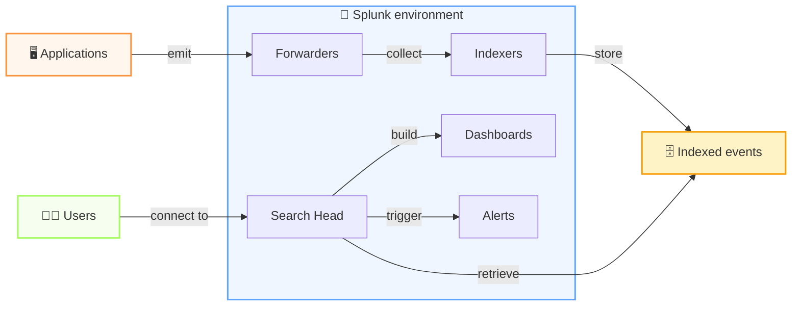

---
# try also 'default' to start simple
theme: seriph
# random image from a curated Unsplash collection by Anthony
# like them? see https://unsplash.com/collections/94734566/slidev
background: /images/glowing-digital-interface-stockcake.jpg
colorSchema: dark
# some information about your slides (markdown enabled)
title: Reduce Log Ingestion Costs With Pattern Detection in Splunk
info: |
  ## Slidev Starter Template
  Presentation slides for developers.

  Learn more at [Sli.dev](https://sli.dev)
# apply UnoCSS classes to the current slide
class: text-center
# https://sli.dev/features/drawing
drawings:
  persist: false
# slide transition: https://sli.dev/guide/animations.html#slide-transitions
transition: slide-left
# enable Comark Syntax: https://comark.dev/syntax/markdown
comark: true
# duration of the presentation
duration: 35min
---

# Reduce Log Ingestion Costs 
## with Pattern Detection in Splunk

    
Michele Caci

    
Senior Software Engineer @ Amadeus

    

      <a href="https://github.com/mcaci" target="_blank" alt="Michele's GitHub" title="Michele's GitHub"
        class="text-xl slidev-icon-btn opacity-50 !border-none !hover:text-white">
        <carbon-logo-github />
      </a>
      <a href="https://www.linkedin.com/in/michele-caci-47770132/" target="_blank" alt="Michele's Linkedin" title="Michele's Linkedin"
        class="text-xl slidev-icon-btn opacity-50 !border-none !hover:text-white">
        <carbon-logo-linkedin />
      </a>
    

---
src: ./pages/intro-talkoutline.md
hide: false
---

---
src: ./pages/problem-statement-intro.md
hide: false
---

---
src: ./pages/whoami.md
hide: false
---

# We log too much
<v-click>

## And if you're here, you probably log too much too
</v-click>

---
layout: center
---

<!-- Left: the numbers -->

  

    
~50 TB

    
of logs ingested per day at Amadeus

  

  

    <!-- 
109
 -->
    
1 billion

    
events generated daily

  

  

    <!-- 
100s
 -->
    
Hudreds

    
of applications, pipelines, and services

  

<!-- Right: the stream -->

  

  

    2026-06-30T08:42:01.003Z INFO  [booking-svc]    trx=8f3a2 Request received POST /orders 
    2026-06-30T08:42:01.004Z DEBUG [db-pool]        trx=8f3a2 Acquiring connection pool=main 
    2026-06-30T08:42:01.006Z DEBUG [db-pool]        trx=8f3a2 Connection acquired latency=2ms 
    2026-06-30T08:42:01.008Z INFO  [booking-svc]    trx=8f3a2 Validating passenger data fields=12 
    2026-06-30T08:42:01.009Z DEBUG [validator]      trx=8f3a2 Field check: name OK 
    2026-06-30T08:42:01.009Z DEBUG [validator]      trx=8f3a2 Field check: dob OK 
    2026-06-30T08:42:01.010Z DEBUG [validator]      trx=8f3a2 Field check: passport OK 
    2026-06-30T08:42:01.011Z DEBUG [cache]          trx=8f3a2 Cache miss key=passenger:8f3a2 
    2026-06-30T08:42:01.013Z DEBUG [db-pool]        trx=8f3a2 Acquiring connection pool=main 
    2026-06-30T08:42:01.014Z DEBUG [db-pool]        trx=8f3a2 Connection acquired latency=1ms 
    2026-06-30T08:42:01.021Z INFO  [pricing-svc]    trx=8f3a2 Fetching fare rules origin=NCE 
    2026-06-30T08:42:01.023Z DEBUG [http-client]    trx=8f3a2 GET /fare-rules timeout=5000ms 
    2026-06-30T08:42:01.038Z DEBUG [http-client]    trx=8f3a2 Response 200 latency=15ms 
    2026-06-30T08:42:01.039Z DEBUG [cache]          trx=8f3a2 Cache miss key=fare:NCE:Y 
    2026-06-30T08:42:01.041Z INFO  [booking-svc]    trx=8f3a2 Seat availability check flight=AF123 
    2026-06-30T08:42:01.055Z DEBUG [db-pool]        trx=8f3a2 Acquiring connection pool=replica 
    2026-06-30T08:42:01.056Z DEBUG [db-pool]        trx=8f3a2 Connection acquired latency=1ms 
    2026-06-30T08:42:01.071Z INFO  [booking-svc]    trx=8f3a2 Booking confirmed ref=AMZ-99812 
    2026-06-30T08:42:01.072Z INFO  [audit-svc]      trx=8f3a2 Audit event BOOKING_CONFIRMED 
    2026-06-30T08:42:01.073Z DEBUG [notify]         trx=8f3a2 Queuing confirmation email 
    2026-06-30T08:42:01.003Z INFO  [booking-svc]    trx=8f3a2 Request received POST /orders 
    2026-06-30T08:42:01.004Z DEBUG [db-pool]        trx=8f3a2 Acquiring connection pool=main 
    2026-06-30T08:42:01.006Z DEBUG [db-pool]        trx=8f3a2 Connection acquired latency=2ms 
    2026-06-30T08:42:01.008Z INFO  [booking-svc]    trx=8f3a2 Validating passenger data fields=12 
    2026-06-30T08:42:01.009Z DEBUG [validator]      trx=8f3a2 Field check: name OK 
    2026-06-30T08:42:01.009Z DEBUG [validator]      trx=8f3a2 Field check: dob OK 
    2026-06-30T08:42:01.010Z DEBUG [validator]      trx=8f3a2 Field check: passport OK 
    2026-06-30T08:42:01.011Z DEBUG [cache]          trx=8f3a2 Cache miss key=passenger:8f3a2 
    2026-06-30T08:42:01.013Z DEBUG [db-pool]        trx=8f3a2 Acquiring connection pool=main 
    2026-06-30T08:42:01.014Z DEBUG [db-pool]        trx=8f3a2 Connection acquired latency=1ms 
    2026-06-30T08:42:01.021Z INFO  [pricing-svc]    trx=8f3a2 Fetching fare rules origin=NCE 
    2026-06-30T08:42:01.023Z DEBUG [http-client]    trx=8f3a2 GET /fare-rules timeout=5000ms 
    2026-06-30T08:42:01.038Z DEBUG [http-client]    trx=8f3a2 Response 200 latency=15ms 
    2026-06-30T08:42:01.039Z DEBUG [cache]          trx=8f3a2 Cache miss key=fare:NCE:Y 
    2026-06-30T08:42:01.041Z INFO  [booking-svc]    trx=8f3a2 Seat availability check flight=AF123 
    2026-06-30T08:42:01.055Z DEBUG [db-pool]        trx=8f3a2 Acquiring connection pool=replica 
    2026-06-30T08:42:01.056Z DEBUG [db-pool]        trx=8f3a2 Connection acquired latency=1ms 
    2026-06-30T08:42:01.071Z INFO  [booking-svc]    trx=8f3a2 Booking confirmed ref=AMZ-99812 
    2026-06-30T08:42:01.072Z INFO  [audit-svc]      trx=8f3a2 Audit event BOOKING_CONFIRMED 
    2026-06-30T08:42:01.073Z DEBUG [notify]         trx=8f3a2 Queuing confirmation email 
  

---
layout: statement
---

# We pay for those logs

<!-- 
So let's see how we can reduce those costs, but first -->

---
layout: center
class: text-center
---

  <h1 class="text-4xl font-bold tracking-tight">Michele Caci</h1>
  
Senior Software Engineer @ Logging team in Amadeus

  

    
Focus

    
Logging - OpenTelemetry

  

  

    
Stack

    
Go · K8S - Splunk

  

  

    
Hobbies

    
Cooking, Languages, Board Games

  

  

    
Full-time job

    
Surviving Fatherhood

  

---
layout: default
---

# The Problem With Logging Everything

  <!-- Card 1: Cost -->
  

    
💸

    
High Cost

    

      Splunk licenses on <strong class="text-white">ingestion volume</strong>.
      Every DEBUG line, every heartbeat, every
      redundant stack trace — you pay for all of it.
    

    

      cost = volume × price/GB
    

  

  <!-- Card 2: Low signal -->
  

    
📉

    
Low Signal

    

      When everything is logged, <strong class="text-white">nothing stands out</strong>.
      Finding a real error means wading through
      thousands of irrelevant lines.
    

    

      noise drowns the signal
    

  

  <!-- Card 3: Unread -->
  

    
👻

    
Never Read

    

      Studies show <strong class="text-white">~80% of logs</strong> are
      never queried after ingestion. You're storing
      and indexing data nobody will ever look at.
    

    

      <a href="https://your-source-link" class="underline opacity-70 hover:opacity-100">
        Source: [your citation here]
      </a>
    

  

<!-- Bottom stat bar -->

  
80%

  

    of ingested logs are <strong class="text-white">never read</strong> — yet you pay to ingest,
    index, and retain every byte. The goal isn't to log less blindly:
    it's to log <strong class="text-white">smarter</strong>, and find what's safe to cut.
  

---
layout: fact
---

# 80% of your logs are never read
# Don't log less  <v-click> Log smart</v-click>

---
layout: center
class: text-center
---

  
The good news

  <h1 class="text-5xl font-black leading-tight max-w-2xl">
    You don't need to log less. 
    You need to log smarter.
  </h1>

  

    If your team uses Splunk, you already have everything you need
    to find the noise, understand the patterns, and make
    data-driven decisions about what to cut.
  

  

    

      🔍 Find the heavy hitters
    

    

      📊 Understand the patterns
    

    

      ✂️ Cut with confidence
    

  

---
layout: default
---

# Splunk at a Glance

---

  <!-- Left: DevOps / Ingestion view -->
  

    

      🔧 DevOps View — How logs get in
    

    <!-- Pipeline diagram -->
    

      

        🖥️
        

          
Applications / Services

          
emit logs to stdout, files, or syslog

        

      

      
↓

      

        🚚
        

          
Forwarder

          
Universal Forwarder · HEC · Syslog

        

      

      
↓

      

        ⚙️
        

          
Indexer

          
parses, indexes, stores — this is what you pay for

        

      

      
↓

      

        🗄️
        

          
Indexes

          
partitioned by app / phase / event type

        

      

    

  

  <!-- Right: User / Analyst view -->
  

    

      👤 User View — How you interact with it
    

    

      

        🗂️
        

          
Indexes

          

            Your entry point. One app may write to several indexes:
            audit, functional, monitoring, debug…
          

        

      

      

        🔎
        

          
Search (SPL)

          

            Splunk's query language. The tool we'll use today
            to surface patterns and outliers.
          

        

      

      

        📋
        

          
Saved Searches & Alerts

          

            Schedule queries to run automatically.
            Useful for ongoing volume monitoring.
          

        

      

      

        📊
        

          
Dashboards

          

            We'll build one of these by the end — a live view
            of your log volume, patterns, and top offenders.
          

        

      

    

  

---
src: ./pages/intro-splunk.md
hide: false
---

---
src: ./pages/before-storage.md
hide: false
---

---
src: ./pages/after-storage.md
hide: false
---

---
layout: end
---

Thank you very much!

---
layout: default
---

# Splunk Architecture

  <!-- Sources -->
  

    

      🖥️ 
App Servers

    

    

      ☸️ 
Kubernetes

    

    

      🗃️ 
Databases

    

    

      🔌 
APIs / Services

    

  

  
↓

  <!-- Ingestion -->
  

    

      🚚 
Universal Forwarder

    

    

      📡 
HEC

    

    

      📨 
Syslog / TCP

    

  

  
↓

  <!-- Indexer + Storage side by side -->
  

    

      ⚙️ Indexer
      
parsing · field extraction · routing

      
props.conf / transforms.conf

    

    

      🗄️ Indexes
      
hot · warm · cold buckets

      
ingestion volume = your bill

    

  

  
↓

  <!-- Consumption -->
  

    

      🔎 
SPL Searches

    

    

      📊 
Dashboards

    

    

      🔔 
Alerts

    

  

---
layout: two-cols
---

# The DevOps View
## Where cost is born

  

    Your leverage is <strong class="text-white">before</strong> data hits
    the indexer — filter, sample, or drop at the forwarder.
  

  

    
inputs.conf

    
Controls what the forwarder collects — file paths, ports, scripts

  

  

    
props.conf + transforms.conf

    
Filter, route, or drop events before indexing — the most cost-effective lever

  

  

    
indexes.conf

    
Define retention and routing per index — align with data criticality

  

  

    💡 Dropping at the forwarder costs nothing. Dropping after indexing saves nothing.
  

::right::

  

    
# props.conf

    
[source::/var/log/myapp.log]

    
TRANSFORMS-drop = drop-debug-lines

     
    
# transforms.conf

    
[drop-debug-lines]

    
REGEX = \sDEBUG\s

    
DEST_KEY = queue

    
VALUE = nullQueue

  

  

    nullQueue = discarded before indexing
  

  

    
Typical index layout

    

      
📁 app_audit

      
compliance, long retention

      
📁 app_functional

      
business events

      
📁 app_monitoring

      
metrics, health checks

      
📁 app_debug

      
💸 biggest, least read

    

  

---
layout: two-cols
---

# The User View
## Where insight is found

  

    Your interface is <strong class="text-white">SPL</strong>.
    Everything from ad-hoc queries to automated reports runs through it.
  

  

    
1. Pick your index

    
Start narrow — target the index most likely to hold the noise

  

  

    
2. Aggregate by transaction

    
Group by <code class="text-blue-300">trx_id</code> to find which flows generate the most volume

  

  

    
3. Find patterns

    
Use <code class="text-blue-300">| patterns</code> and <code class="text-blue-300">| cluster</code> to group similar messages automatically

  

  

    
4. Build a dashboard

    
Operationalize findings so the whole team can monitor volume trends

  

::right::

  

    
| A typical SPL investigation

     
    
index=app_debug earliest=-7d

     
    
| stats count by trx_id, log_level

    
-- volume per transaction

     
    
| sort -count

    
-- worst offenders first

     
    
| head 20

    
-- focus on top 20

  

  

    
SPL commands we'll use today

    

      
<code class="text-blue-300">stats count by</code> — aggregate volume

      
<code class="text-blue-300">| patterns</code> — cluster similar messages

      
<code class="text-blue-300">| cluster</code> — ML-based grouping

      
<code class="text-blue-300">| collect</code> — save to a summary index

      
<code class="text-blue-300">| outputlookup</code> — export for comparison

    

  

  
Michele Caci

  

    <a href="https://github.com/mcaci" target="_blank" alt="Michele's GitHub" title="Michele's GitHub"
      class="text-xl slidev-icon-btn opacity-50 !border-none !hover:text-white">
      <carbon-logo-github />
    </a>
    <a href="https://www.linkedin.com/in/michele-caci-47770132/" target="_blank" alt="Michele's Linkedin" title="Michele's Linkedin"
      class="text-xl slidev-icon-btn opacity-50 !border-none !hover:text-white">
      <carbon-logo-linkedin />
    </a>
  

<!--  -->
---
transition: fade-out
---

# How events flow in Splunk

From application logs to searchable insight in a few steps

  
📤 Applications emit logs

  
📦 Splunk ingests and indexes them

  
🧑‍💻 Users run searches, dashboards, and alerts

---
layout: two-cols
---

# Start With the Right Index

  

    Before writing a single query, pick your target carefully.
    An app typically writes to <strong class="text-white">multiple indexes</strong>
    depending on event type — scanning all of them is expensive and noisy.
  

  

    
Typical index taxonomy

    

      

        audit
        Compliance events — keep long, rarely noisy
      

      

        functional
        Business transactions — moderate volume, high value
      

      

        monitoring
        Health checks, metrics — repetitive, good cut candidate
      

      

        debug
        Stack traces, verbose output — <strong class="text-white">start here</strong>
      

    

  

  

    💡 Always scope your query with <code class="text-blue-300">earliest=</code> and
    <code class="text-blue-300">latest=</code> — an unbounded search across a large
    index will time out and hurt other users.
  

::right::

  

    Find your biggest indexes first
  

  

    
| List indexes with their current size

     
    
| rest splunk_server=local

    
  /services/data/indexes

     
    
| table title,

    
  currentDBSizeMB,

    
  totalEventCount,

    
  maxTotalDataSizeMB

     
    
| sort -currentDBSizeMB

  

  

    
What to look for

    

      
📈 Indexes growing faster than expected

      
📦 Size disproportionate to their business value

      
🔎 Indexes nobody has searched in weeks

    

  

---
layout: two-cols
---

# Log Volume by Transaction

  

    If your app logs a <code class="text-blue-300">trx_id</code> (and it should),
    you can immediately answer: <strong class="text-white">which transaction types
    are generating the most lines?</strong>
  

  

    

      
Step 1 — Count lines per transaction

      

        Group all events by <code class="text-blue-300">trx_id</code> and count.
        This gives you the distribution of log volume across transaction instances.
      

    

    

      
Step 2 — Find the outliers

      

        Some transactions will have 10× the lines of others.
        Those are your first candidates — either they're genuinely complex,
        or they're logging too verbosely.
      

    

    

      
Step 3 — Break down by log level

      

        A transaction with 500 lines — how many are
        <code class="text-red-400">ERROR</code> vs
        <code class="text-yellow-400">WARN</code> vs
        <code class="text-gray-400">DEBUG</code>?
        If 490 are DEBUG, you have your answer.
      

    

  

::right::

  

    
| Step 1: volume per transaction type

     
    
index=app_debug
    earliest=-24h

     
    
| rex "trx_id=(?P&lt;trx_type&gt;[A-Z_]+)"

    
-- extract the type prefix from trx_id

     
    
| stats

    
  count,

    
  avg(count) as avg_lines,

    
  max(count) as max_lines

    
  by trx_type

     
    
| sort -count

  

  

    
| Step 2: break down by log level

     
    
index=app_debug
    earliest=-24h

    
trx_type=BOOKING

     
    
| stats count by log_level

    
| eventstats sum(count) as total

    
| eval pct=round(count/total*100,1)

    
| sort -count

  

---
layout: two-cols
---

# Finding Patterns — Exact Matches

  

    Start with what you already suspect. Exact match queries are fast,
    precise, and easy to act on — if a specific message dominates,
    you know exactly what to tell the team to fix.
  

  

    

      
Top N messages by frequency

      

        Extract the log message text, strip dynamic values
        (IDs, timestamps, counts), then count by the
        normalized template. The top results are your biggest wins.
      

    

    

      
The <code class="text-purple-300">| top</code> command

      

        Quickest way to find dominant values in any field.
        Combine with <code class="text-blue-300">useother=t</code>
        to see what percentage the top N covers.
      

    

    

      💡 A single repeated message accounting for 30%+ of your index
      volume is not unusual — and is almost always safe to suppress
      or downsample.
    

  

::right::

  

    
| Top repeated messages

     
    
index=app_debug
    earliest=-7d

     
    
| rex field=_raw

    
  "(?i)(?:INFO|DEBUG|WARN|ERROR)\s+(?P&lt;msg&gt;.+)"

     
    
| rex field=msg

    
  mode=sed "s/[0-9a-f-]{8,}/&lt;ID&gt;/g"

    
-- normalize dynamic values

     
    
| top limit=20 msg

    
  useother=t showperc=t

  

  

    
| Quick frequency check on a known message

     
    
index=app_debug

    
"Connection acquired"

     
    
| timechart

    
  span=1h count

    
-- is it constant or spiky?

  

---
layout: two-cols
---

# Finding Patterns — Let Splunk Do It

  

    When you don't know what to look for,
    <code class="text-blue-300">| cluster</code> group similar
    log lines <strong class="text-white">automatically</strong> —
    no regex needed.
  

  

    

      

        <code>| cluster</code>
      

      

        ML-based clustering — groups events by semantic similarity,
        not just structure. Slower, but surfaces groupings
        that <code class="text-blue-300">| patterns</code> misses.
        Use <code class="text-blue-300">t=0.8</code> to tune sensitivity.
      

    

    

      

        <code>| collect</code>
      

      

        Save pattern results to a summary index for trending over time.
        Lets you answer: is this pattern growing week over week?
      

    

  

::right::

  

    
| Pattern detection — first pass

     
    
index=app_debug
    earliest=-24h

     
    
| patterns

    
  field=_raw

    
  maxPatterns=20

     
    
| sort -count

    
| table count, pattern

  

  

    
| ML clustering — deeper grouping

     
    
index=app_debug
    earliest=-24h

     
    
| cluster

    
  field=_raw t=0.8

     
    
| stats

    
  count, values(_raw) as sample

    
  by cluster_label

     
    
| sort -count

  

  

    
| Save patterns to summary index

     
    
| collect

    
  index=summary_log_patterns

    
  addtime=true

  

---
layout: default
---

# Put It All in a Dashboard

  <!-- Panel 1 -->
  

    
Panel 1

    
Index Volume Over Time

    

      Timechart of ingestion volume per index.
      Spot regressions — a deployment that suddenly
      doubles log output shows up immediately.
    

    

      | timechart span=1d sum(kb) by index
    

  

  <!-- Panel 2 -->
  

    
Panel 2

    
Top Transaction Types

    

      Bar chart of log count by transaction type.
      Lets the team see at a glance which flows
      dominate — updated daily.
    

    

      | stats count by trx_type | sort -count
    

  

  <!-- Panel 3 -->
  

    
Panel 3

    
Log Level Breakdown

    

      Pie or stacked bar of ERROR / WARN / INFO / DEBUG ratio.
      A healthy app should have very little DEBUG in production.
    

    

      | stats count by log_level
    

  

  <!-- Panel 4 -->
  

    
Panel 4

    
Top Repeated Patterns

    

      Table of the 20 most frequent log templates.
      Each row is a candidate for suppression,
      sampling, or a log level change.
    

    

      | cluster field=_raw | sort -count
    

  

  <!-- Panel 5 -->
  

    
Panel 5

    
Outlier Transactions

    

      Transactions with line counts more than 2σ
      above average. These are your debugging sessions
      that forgot to turn off verbose logging.
    

    

      | eventstats avg(count) as avg, stdev(count) as sd by trx_type
    

  

  <!-- Panel 6 -->
  

    
The goal

    
A shared, living artifact

    

      Save this dashboard and share it with your team.
      Schedule the heavy queries as saved searches
      running nightly — the dashboard becomes a
      <strong class="text-white">cost accountability tool</strong>,
      not a one-off investigation.
    

  

---
transition: fade-out
---

# 1. Start with the right scope

  <ul class="text-xl leading-10">
    <li>🧭 Choose the right index and time range first</li>
    <li>🧩 Split data by app, component, phase, or event type</li>
    <li>🎯 Focus on the highest-volume sources before touching everything</li>
  </ul>
  

    
SPL template

    <pre class="text-xs leading-6"><code>index=your_index earliest=-1h latest=now
| stats count by host, source</code></pre>
  

---
transition: fade-out
---

# 2. Group by transaction

  <ul class="text-xl leading-10">
    <li>🔗 Use transaction IDs or correlation IDs when available</li>
    <li>📊 Count events per transaction to reveal noisy flows</li>
    <li>⚠️ Spot outliers: a small number of transactions may explain most of the volume</li>
  </ul>
  

    
SPL template

    <pre class="text-xs leading-6"><code>index=your_index
| stats count by transaction_id
| sort -count</code></pre>
  

---
transition: fade-out
---

# 3. Look for repeated patterns

  <ul class="text-xl leading-10">
    <li>🔎 Search for exact repeated messages and frequent values</li>
    <li>🔁 Watch for retries, boilerplate logs, and duplicate events</li>
    <li>🧠 Use <code>stats</code>, <code>top</code>, <code>rare</code>, and <code>collect</code> to uncover patterns</li>
  </ul>
  

    
SPL template

    <pre class="text-xs leading-6"><code>index=your_index
| stats count by message
| sort -count
| where count > 100</code></pre>
  

---
transition: fade-out
---

# 4. Turn findings into action

  <ul class="text-xl leading-10">
    <li>📈 Build a dashboard, saved search, or alert to keep the signal visible</li>
    <li>🛑 Decide whether to suppress, sample, or redesign noisy logging</li>
    <li>✅ Measure the impact and iterate as the system evolves</li>
  </ul>
  

    
SPL template

    <pre class="text-xs leading-6"><code>index=your_index
| stats count by message
| where count > 1000
| eval action="review logging"</code></pre>
  

---
layout: center
class: text-center
---

Thank you very much!

  
Michele Caci

  

    <a href="https://github.com/mcaci" target="_blank" alt="Michele's GitHub" title="Michele's GitHub"
      class="text-xl slidev-icon-btn opacity-50 !border-none !hover:text-white">
      <carbon-logo-github />
    </a>
    <a href="https://www.linkedin.com/in/michele-caci-47770132/" target="_blank" alt="Michele's Linkedin" title="Michele's Linkedin"
      class="text-xl slidev-icon-btn opacity-50 !border-none !hover:text-white">
      <carbon-logo-linkedin />
    </a>
  

<!--  -->

