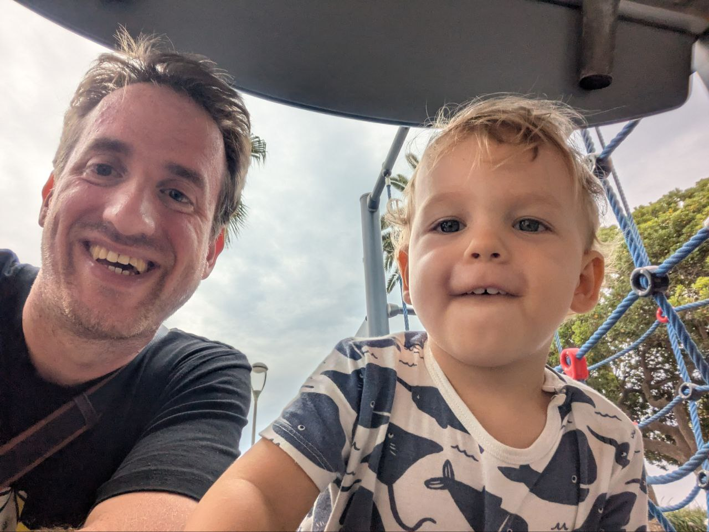
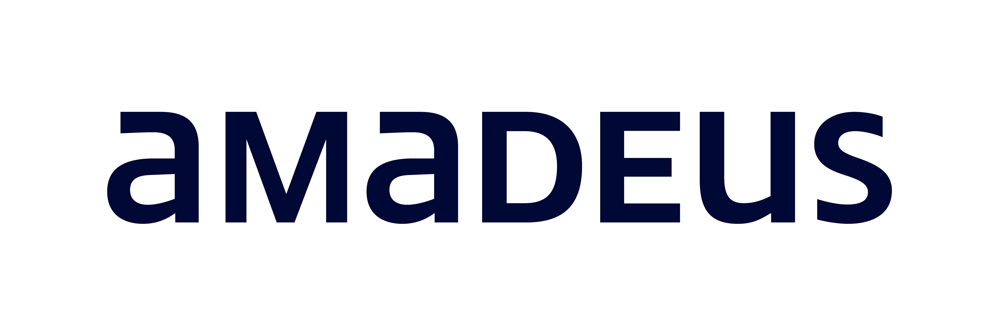
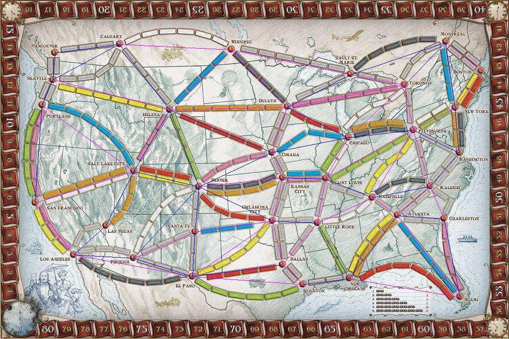
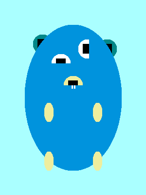

---
# try also 'default' to start simple
theme: seriph
# random image from a curated Unsplash collection by Anthony
# like them? see https://unsplash.com/collections/94734566/slidev
background: https://cover.sli.dev
# some information about your slides (markdown enabled)
title: Reduce Log Ingestion Costs With Pattern Detection in Splunk
info: |
  ## Slidev Starter Template
  Presentation slides for developers.

  Learn more at [Sli.dev](https://sli.dev)
# apply UnoCSS classes to the current slide
class: text-center
# https://sli.dev/features/drawing
drawings:
  persist: false
# slide transition: https://sli.dev/guide/animations.html#slide-transitions
transition: slide-left
# enable Comark Syntax: https://comark.dev/syntax/markdown
comark: true
# duration of the presentation
duration: 35min
---

# Reduce Log Ingestion Costs

with Pattern Detection in Splunk

  Press Space for next page <carbon:arrow-right />

  <button @click="$slidev.nav.openInEditor()" title="Open in Editor" class="slidev-icon-btn">
    <carbon:edit />
  </button>
  <a href="https://github.com/slidevjs/slidev" target="_blank" class="slidev-icon-btn">
    <carbon:logo-github />
  </a>

<!--
The last comment block of each slide will be treated as slide notes. It will be visible and editable in Presenter Mode along with the slide. [Read more in the docs](https://sli.dev/guide/syntax.html#notes)
-->

---
---

# Title, abstract and talk info

**Reduce Log Ingestion Costs With Pattern Detection in Splunk**

By Michele Caci

Snorkeling Session (25 min) on Wednesday 8 July 16:40 - 17:05

Amphi 139 (160 places)

This session presents a Splunk dashboard designed to analyze log behavior, reveal high‑volume patterns, and highlight opportunities to reduce ingestion costs. Participants will learn how to identify repetitive noise, detect inefficient logging, and focus on events that matter. The session provides practical techniques to optimize log volume, improve observability, and support data‑driven decisions.

---
---

# Outline

Time breakdown idea: **Intro .1-.4**: 5 minutes; **Splunk .5**: 5 minutes; **How .6**: 10 minutes; **Q/A**: 5 minutes

1. Self-intro
2. Introduction: we (amadeus) log a lot, really a lot (vague order of magnitude) and you do too.
3. Problem statement: Many logs = high costs = low signal/noise ratio, 80% of logs are not read (link quote)
4. Main point: if you are using splunk I will show techniques you can use to find ways to reduce logs
5. Splunk overview: high-level architecture + devops view (deployment and log ingestion) vs user view (index creation, searches, splunk application/dashboards and saved searches)
6. What to analyze and how:
- which index to look at (an app can usually log to different indexes according to phase/app component/event type(audit,classic,functional monitoring,...))
- Logging by transaction: if not you should. group and count logs by trx_id. find outliers (transaction with high count)
- Patterns: queries for exact matches and for finding patterns `collect` command and others.
- Put all in a dashboard

---
layout: statement
---

# We have a logging problem

We log a lot

---
layout: statement
---

# I mean we really log a lot

We're talking PBs here

---
layout: statement
---

# And if you're here you probably log a lot too

---
layout: intro
---

# 👋 Hello

Who am I?

- I'm Michele
- I deploy and operate the Amadeus logging infrastructure to help applications detect issues from logs
- My hobbies include languages, board games and silly GIFs with Go

 

<arrow v-after x1="800" y1="305" x2="825" y2="250" color="#F00" width="1" arrowSize="1" />

me

young

actual me

<arrow v-after x1="580" y1="125" x2="640" y2="125" color="#F00" width="1" arrowSize="1" />

こんにちわ！

Bom dia!  

---
layout: fact
---

# 80% of your logs are never read

---
layout: statement
---

# High volume of logs == low signal to noise ratio

---
layout: statement
---

# High volume of logs == high costs

---
---

# Splunk provides tools to show you places where you can cut logs

---
src: ./pages/intro-splunk.md
hide: false

---
---
src: ./pages/before-storage.md
hide: false
---

---
src: ./pages/after-storage.md
hide: false
---

---
layout: center
class: text-center
---

# Learn More

[Documentation](https://sli.dev) · [GitHub](https://github.com/slidevjs/slidev) · [Showcases](https://sli.dev/resources/showcases)

<PoweredBySlidev mt-10 />
